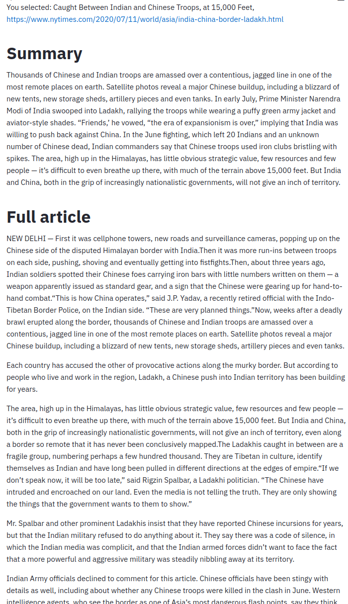

## *NY Times* Article Summarizer

Applies Facebook's BART model [[Lewis et al.,2020]](https://scontent-sea1-1.xx.fbcdn.net/v/t39.8562-6/106373513_3414102562251474_8005430471454563564_n.pdf?_nc_cat=105&ccb=2&_nc_sid=ae5e01&_nc_ohc=lV9llJ8AqhAAX8tDSOA&_nc_ht=scontent-sea1-1.xx&oh=cd7f9e0463fd070a899730fc5a98724b&oe=5FDF7984), as implemented by HuggingFace, to summarize articles from the NY Times.

<table>
<tr valign="top">
<td>This is a streamlit app that does several things:

* uses the <em>NY Times</em> Top Stories API to get current metadata
* creates sidebar dropdown from top 5 URLs and titles
* when user selects a title:
  * fetches the article from <em>Times</em> website
  * extracts body of article using BeautifulSoup
  * article is truncated to 720 words maximum&dagger;
  * applies Bart summarizer model
  * displays summary, full article, profiling info
* Streamlit's caching capabilities obviate repeating steps &mdash; e.g., initializing the model, fetching and extracting text from an article already parsed

&dagger;Summarizer can fail if text is too long.

See [streamlitSummarizer.py](https://github.com/mw0/ArticleSummarizer/blob/master/python/streamlitSummarizer.py) for source code.
</td><td width="700">
</tr>
</table>
